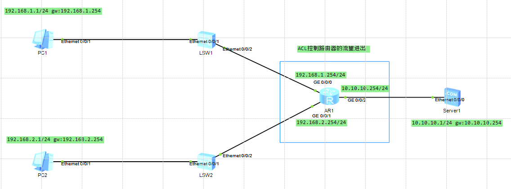

# ACL实验
## 是什么
访问控制列表。

基础规则范围：2000-2999

高级规则范围：3000-3999

更高级规则范围：4000-4999

## 做什么
能够限制哪些 IP 或端口通过路由器。

## 怎么做
### 命令
`[R1]ACL 3000`:创建或进入高级配置

`[R1-acl-adv-3000]rule 5 deny ip source 192.168.1.0 0.0.0.255 destination 192.168.2.0 0.0.0.255`:

**rule 5**：创建规则 5，acl 执行顺序会按照规则 id 来匹配。规则 id 小的先匹配，匹配到后不匹配后面的 id。

**deny**:表示拒绝

`[R1-GigabitEthernet0/0/0]traffic-filter inbound acl 3000`:

