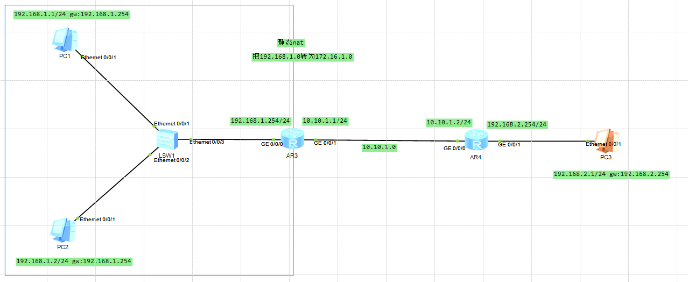
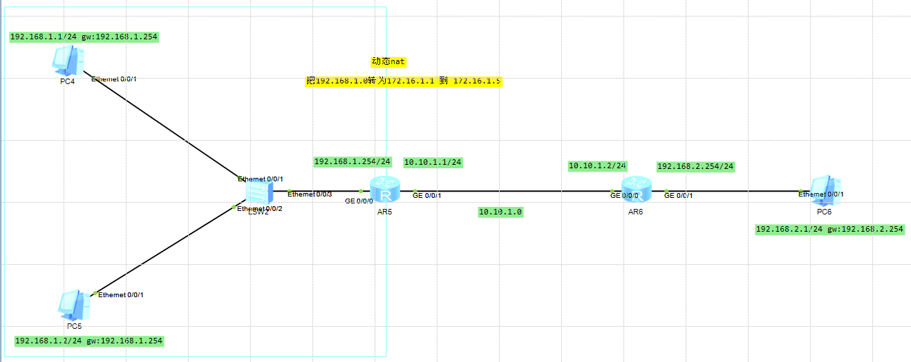
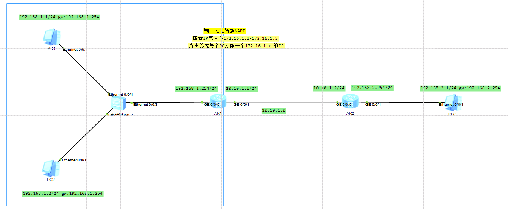

# NAT地址转换技术
## 是什么
是一种将私有网络中的 IP 地址映射到公有网络上的 IP 地址技术。

## 做什么
NAT 主要作用是在不同的地址空间之间进行转换，使得多个内网设备共享一个公有 IP 地址进行通信。

## 怎么做
### 静态NAT命令
> 静态NAT是一种一对一的映射方式，每个内网IP地址都映射到一个公有IP地址。适用于内网中需要与外网直接通信的设备，例如Web服务器、邮件服务器等。
示例：内网IP 192.168.1.2 总是映射到公网IP 203.0.113.2。

`int g0/0/1`:路由器出口的网口

`nat static global 172.16.1.1 inside 192.168.1.1`: 将源地址是 192.168.1.1 的IP转为 172.16.1.1 发送出去

### 动态NAT命令
> 动态NAT是一种一对多的映射方式，多个内网IP地址共享一组公有IP地址池。当内网设备访问外网时，NAT设备会从池中分配一个公有IP地址给内网设备使用，映射关系是临时的。
示例：内网设备可以使用池中的任意一个公网IP地址。

>特点：要给定一个 IP 地址池，通过 acl 绑定配合使用.

>缺点：动态 NAT 有绑定和解绑的过程，效率慢

`[R1]nat address-group 1 172.16.1.1 172.16.1.5`:创建地址组1，设置IP范围为172.16.1.1 到 172.16.1.5

`[R1]acl 2000`:进入 acp 规则中

`[R1-acl-basic-2000]rule 5 permit source 192.168.1.0 0.0.0.255`:创建规则 5，允许源地址通过

`[R1-acl-basic-2000]quit`

`[R1]int g0/0/1`

`[R1-GigabitEthernet0/0/1]nat outbound 2000 address-group 1 no-pat`:配置出站NAT，并禁用端口地址转换

**nat outbound**：这表示配置出站 NAT，即将内网设备的源地址转换为公网地址。
>出站 NAT 通常用于允许内网设备访问外部网络（例如，互联网），并将内网 IP 地址转换为公网 IP 地址。

**address-group 1**：address-group 指定了一个 IP 地址组。
>在这个命令中，1 表示使用编号为 1 的地址组。地址组是由一组 IP 地址组成的集合，NAT 配置将这些地址作为出站 NAT 的公网 IP 地址池。

**no-pat**:禁用端口地址转换
>在正常的 PAT 配置中，多个内部设备共享一个公网 IP 地址，区分每个会话通过不同的端口号（端口重用）。而使用 no-pat 时，每个内部设备将使用不同的公网 IP 地址，禁用端口号重用。每个内网设备都会分配一个独立的公网 IP 地址。
这个选项通常用于确保每个内网设备有自己的公网 IP 地址，而不共享公网地址。

### 端口地址(NAPT)转换NAT命令
> PAT 是 NAT 的一种特殊形式，它允许多个内网设备共享同一个公网IP地址。通过在源端口上进行转换，每个内网设备的会话可以被唯一标识。
示例：多个内网设备的源IP地址都转换为一个公网IP地址，但使用不同的端口号来区分不同的连接。

>特点：传输效率高，经常使用。

**配置和动态 NAT 步骤几乎一致，有以下不同，不需要 no-pat**
`[R1-GigabitEthernet0/0/1]nat outbound 2000 address-group 1`

### easy IP 命令
>是一种简单的 NAT 转换技术，通常用于将内网设备通过单一公网 IP 地址访问互联网.Easy IP 自动将内网设备的私有 IP 地址映射到路由器的出口接口的公共 IP 地址。
这种映射是动态的，内网设备使用出口接口的 IP 地址访问互联网，而不需要额外分配专门的公网 IP 地址。

`[R1]acl 2000`:进入 acp 规则中

`[R1-acl-basic-2000]rule 5 permit source 192.168.1.0 0.0.0.255`:创建规则 5，允许源地址通过

`int g0/0/1`

`[R1-GigabitEthernet0/0/1]nat outbound 2000`使内网所有 IP 出去时，使用 g0/0/1 网口的 IP 去通信

## 原理是什么

