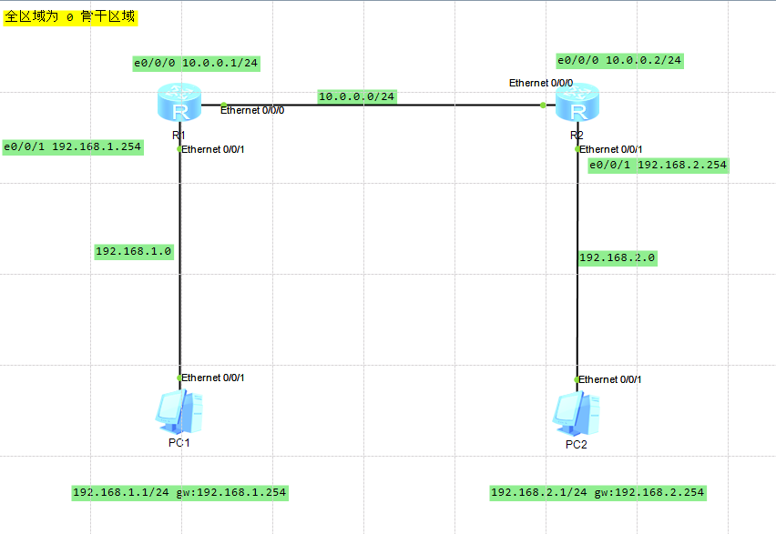

# vlan
## 定义（vlan 是什么）
是一种网络技术，允许在物理网络基础上创建逻辑分离的网络，通过vlan，可以将一个物理网络划分为多个虚拟网络，以实现更高效，更安全的网络管理。

## 核心概念（vlan 的作用）
1. 逻辑分离
* vlan 将网络设备按逻辑分组，即使它们链接在同一个物理交换机上， 也属于不同的广播域。
* 例如，不同部门的电脑可以划分到不同的 vlan，彼此之间无法直接通信

2. 广播域划分
* vlan的每个分组是一个独立的广播域，这减少了广播风暴的影响，提高了网络性能

3. 标识（vlan id）
* 每个 vlan 通过一个唯一的 vlan id 来标识, 范围为1到4094

## 主要优势（vlan 能做什么）
1. 提高网络的安全性
* 不同 vlan 的设备默认无法通信，除非通过路由器或三层交换机配置路由规则

2. 简化管理
* 通过逻辑分组设备，可以根据业务需求动态调整网络拓扑
* 易于隔离不同部门或业务的网络

3. 减少广播流量
* vlan 将网络分割成多个广播域，限制广播的传输范围

4. 灵活性
* 无需物理上重新布线，只需在交换机中配置 vlan 即可有重新分组

## vlan的工作原理
1. 交换机的角色
* 同一 vlan 下的网络互通，符合交换机的特征

2. 帧打标签
* 不同交换机之间的 vlan 相互通信时，会将传输的以太网帧增加 4 字节的 vlan 标识，可以通过标识来识别不同的 vlan id。

3. 端口模式
* Access Port(接入端口)：
不携带 vlan 标签的的是接入端口。比如，pc、打印机等

* Trunk Port（干道端口）
携带 vlan 标签的是干道端口。比如，交换机和交换机之间

# 网桥
## 网桥是什么
网桥是计算机网络中的一种设备，用来连接不同的局域网端，并在这些段之间转发数据。

## 网桥做什么
1. 连接网络段
* 将多个网络断连接起来，形成一个逻辑上的局域网
* 不同网络段可以使用相同或不同的物理介质

2. 帧转发
* 根据 Mac 地址表，决定帧应该转发到哪个网络段
* 如果目标 Mac 地址不在表中，则会广播到所有端口（未知单播）

3. 隔离冲突域
* 每个网络段都有自己的冲突域，网桥在转发帧时不会将冲突域传递到其他网络段，从而减少冲突，提高网络效率

4. 学习 Mac 地址
* 动态记录每个设备的 Mac 地址与网桥端口的对应关系，构建 Mac 地址表

## 网桥的工作原理
1. 帧接收
* 网桥从某端口接收一个数据帧，并读取数据帧头中的目标 Mac 地址和源 Mac 地址

2. 学习源地址
* 网桥记录帧的源 Mac 地址及其所在的接收端口，将其添加到 Mac 地址表

3. 查找目标 Mac 地址
* 

4. 数据转发
* 转发帧到正确的端口，或者广播到所有端口

# 示例

## rip 协议
命令格式

`[R1]rip` 使用 RIP 命令开启协议进程，默认进程号是 1

`[R1-rip-1]network 10.0.0.0` network 直连的网段(配置通道的网段)
`[R1-rip-1]network 192.168.1.0` network 直连的网段(配置通道的网段)

`[R1-rip-1]dis this` 查看 rip 配置

`[R1-rip-1] undo network 192.168.1.0` 删除网段

`undo rip 1` 删除 rip 协议

适用小型网络

## OSPF 协议
命令格式
`[Huawei]ospf 1` 1 代表进程号，如果没有注明，则默认为进程

`[Huawei-ospf-1]area 0` 区域 ID，配置为区域 0. 区域 0 表示骨干区域，非 0 表示非骨干区域。非骨干区域要和骨干区域相连，否则的话会导致不规范区域，出现不规则区域需要通过其他方式让逻辑上相连

`[Huawei-ospf-1-area-0.0.0.0]network 1.1.1.0  0.0.0.255` network 直连的网段 反子网掩码

适用大型网络