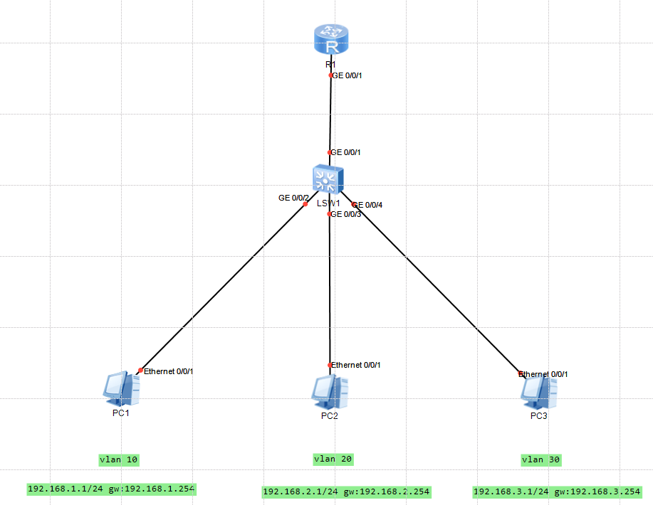

# 单臂路由
## 定义
一个路由器的网口通过逻辑上划分成多个网口，并且每个网口都是独立的。

# 路由器配置
## 命令格式
**[R1] interface GigabitEthernet0/0/1.1**
> 进入逻辑网口，每个真实网口可以有多个逻辑网口

**[R1-GigabitEthernet0/0/1.1] ip address 192.168.1.254 255.255.255.0**
> 配置IP和掩码

**[R1-GigabitEthernet0/0/1.1] dot1q termination vid 10**
    
    dot1q termination:此命令启用 802.1Q VLAN 的终端处理功能。
    vid 10:此命令将路由器的接口配置为支持 VLAN 10，意味着该接口可以接收和处理标记为 VLAN 10 的流量。
    
    当一个路由器接口配置了 dot1q termination vid 10，它就能接收来自 VLAN 10 的标记流量，并正确地将其终止在路由器的该接口上。

**[R1-GigabitEthernet0/0/1.1] arp broadcast enable**
>开启子接口的 ARP 广播功能，如果不配置命令，将会导致该子接口无法主动发送 ARP 广播报文,以及向外转发 IP 报文。

# 交换机配置
## 交换机命令
`vlan batch 10 20 30`: 配置多条 vlan

**交换机-PC**

`int g0/0/2`

`prot link-type access`: 设置为 Access 模式，当端口被设置为 Access 模式时，它只接受未标记的（untagged）VLAN 流量。

`prot default vlan 10`：将该端口的默认 vlan 设置为 vlan 10。所有从该端口进入的未标记流量都会被分配到 VLAN 10。

**交换机-路由器**

`int g0/0/1`

`prot link-type trunk`: 设置为 trunk 模式，当端口被设置为 trunk 模式时，允许交换机端口传输多个 VLAN 的流量。Trunk 端口可以携带多个 VLAN 的标记（tagged）流量，通常用于交换机之间的连接，或交换机与路由器的连接。

`prot trunk allow-pass vlan all`：在 Trunk 模式下，端口默认会传输所有 VLAN 的流量，但也可以手动限制为只传输某些特定的 VLAN。。

